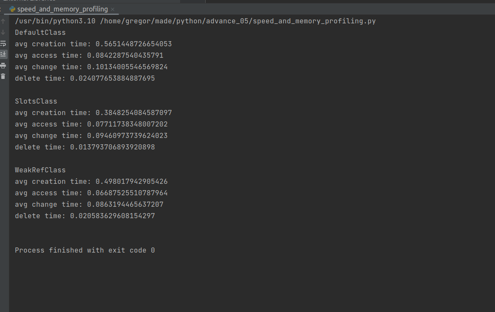

## 1 задание
Создаем 10^5 экземпляров каждого класса. У каждого класса 6 полей.
Запускаем 20 раз процедуры создания, изменения, обращения. 

Видно, что слоты дают большой прирост по времени создания и удаления 
и небольшой прирост по времени изменения.  

